# Perp Curie Subgraph 项目文档

## 项目愿景

perp-curie-subgraph 是为 Perpetual Protocol Curie (V2) 构建的 The Graph Protocol 子图，用于索引和查询区块链上的去中心化永续合约交易数据。该项目提供实时市场数据、交易者活动、资金费率等关键指标的访问接口，为 DeFi 生态系统和分析平台提供数据支持。

## 架构总览

本项目基于 The Graph Protocol 构建，支持多网络部署（Optimism、Sepolia 等），已成功部署至 Satsuma Sepolia 节点。项目采用 AssemblyScript 编写事件处理器，将链上交易数据映射为 GraphQL 实体，支持复杂的金融衍生品数据查询。

### 模块结构图

```mermaid
graph TD
    A["(根) perp-curie-subgraph"] --> B["src/"];
    A --> C["configs/"];
    A --> D["abis/"];
    A --> E["scripts/"];
    A --> F["schema.graphql"];

    B --> G["mappings/"];
    B --> H["utils/"];
    B --> I["hard-fixed-data/"];
    B --> J["constants/"];

    G --> G1["clearingHouse.ts"];
    G --> G2["vault.ts"];
    G --> G3["marketRegistry.ts"];
    G --> G4["accountBalance.ts"];
    G --> G5["exchange.ts"];
    G --> G6["insuranceFund.ts"];
    G --> G7["collateralManager.ts"];
    G --> G8["delegateApproval.ts"];
    G --> G9["limitOrderBook.ts"];
    G --> G10["limitOrderRewardVault.ts"];
    G --> G11["referrer.ts"];

    H --> H1["stores.ts"];
    H --> H2["token.ts"];
    H --> H3["numbers.ts"];

    I --> I1["types.ts"];
    I --> I2["optimism.ts"];
    I --> I3["sepolia.ts"];

    C --> C1["optimism.json"];
    C --> C2["sepolia.json"];
    C --> C3["optimismGoerli.json"];

    D --> D1["ClearingHouse.json"];
    D --> D2["Vault.json"];
    D --> D3["MarketRegistry.json"];
    D --> D4["AccountBalance.json"];
    D --> D5["Exchange.json"];
    D --> D6["InsuranceFund.json"];
    D --> D7["CollateralManager.json"];
    D --> D8["DelegateApproval.json"];
    D --> D9["OrderBook.json"];
    D --> D10["LimitOrderBook.json"];
    D --> D11["LimitOrderRewardVault.json"];
    D --> D12["Referrer.json"];

    E --> E1["healthCheck.ts"];
    E --> E2["listSubgraphIds.ts"];
```



## 模块索引

| 模块路径 | 职责 | 核心文件 |
|---------|------|---------|
| **src/mappings/** | 事件处理器，将链上事件映射为 GraphQL 实体 | 11个映射文件 |
| **src/utils/** | 工具函数库，提供数据处理和存储操作 | stores.ts, token.ts, numbers.ts |
| **src/hard-fixed-data/** | 硬编码数据，定义各网络的配置常量 | types.ts, optimism.ts, sepolia.ts |
| **src/constants/** | 全局常量定义 | index.ts |
| **configs/** | 网络配置文件，定义合约地址和参数 | optimism.json, sepolia.json, optimismGoerli.json |
| **abis/** | 以太坊合约 ABI 定义文件 | 12个 JSON 文件 |
| **scripts/** | 部署和维护脚本 | healthCheck.ts, listSubgraphIds.ts |

## 运行与开发

### 环境要求

- Node.js
- npm
- @graphprotocol/graph-cli
- @perp/curie-deployments

### 核心脚本命令

```bash
# 生成合约 ABI
npm run update-abis <network>

# 更新配置文件
npm run update-configs

# 生成清单文件（针对不同网络）
npm run generate-manifest:optimism
npm run generate-manifest:sepolia

# 代码生成
npm run codegen:optimism
npm run codegen:sepolia

# 生成常量文件
npm run generate-constants:optimism
npm run generate-constants:sepolia

# 部署到 The Graph
npm run deploy-the-graph:optimism
npm run deploy-satsuma:optimism
npm run deploy-satsuma:sepolia

# 健康检查
npm run health-check

# 列出子图 ID
npm run list-subgraph-ids
```

### 当前网络配置

**主网络 (Optimism)**
- Chain ID: 10
- 已部署至 Satsuma 节点
- 支持多种资产：WETH、FRAX、OP、USDT 等

**测试网络 (Sepolia)**
- Chain ID: 11155111
- 已部署至 Satsuma 节点
- 支持资产：WETH、WBTC

## 数据模型

### 核心实体

- **Protocol**: 协议全局状态
- **Market**: 市场信息（交易对、费率、交易量）
- **Trader**: 交易者账户信息
- **Position**: 持仓信息
- **LiquidityChanged**: 流动性变化事件
- **Deposited/Withdrawn**: 存取款事件
- **FundingUpdated**: 资金费率更新
- **Token**: 代币信息

### 合约映射

- **ClearingHouse**: 处理交易和清算事件
- **Vault**: 处理资金存取和清算
- **MarketRegistry**: 管理市场注册信息
- **AccountBalance**: 账户余额和 PnL
- **Exchange**: 资金费率交换
- **InsuranceFund**: 保险基金管理
- **CollateralManager**: 抵押品管理
- **DelegateApproval**: 委托授权
- **LimitOrderBook**: 限价订单簿

## 测试策略

当前项目**缺少测试文件**。建议：
1. 添加单元测试覆盖映射函数
2. 添加集成测试验证完整数据流
3. 使用 mock 数据测试复杂场景
4. 定期执行健康检查脚本

## 编码规范

### TypeScript/AssemblyScript
- 使用 `@graphprotocol/graph-ts` 类型系统
- 采用 camelCase 命名规范
- 每个映射文件处理特定合约事件
- 使用 BigInt 和 BigDecimal 处理数值

### 代码结构
- 映射函数命名：`handle<事件名>`
- 实体创建使用 `getOrCreate` 模式
- 数值转换使用 `fromWei` 等工具函数
- 硬编码数据统一管理

## AI 使用指引

### 与 AI 协作时提供的信息
1. 网络配置文件 (`configs/*.json`)
2. 合约 ABI 文件 (`abis/*.json`)
3. schema.graphql 实体定义
4. 对应的映射文件
5. 具体的错误日志或问题描述

### 常见问题咨询
- 映射逻辑优化建议
- 新的事件类型处理
- 性能优化方案
- 部署问题排查

## 变更记录 (Changelog)

### [2.0.0] - 2025-11-12
- 项目架构文档初始化
- 扫描并记录所有模块结构
- 生成模块级文档
- 建立覆盖率报告

### [1.1.0] - 2022-03-29
- 移除不正确的数据属性
- 删除 `Market.baseAmount`、`Market.quoteAmount`、`OpenOrder.baseAmount`、`OpenOrder.quoteAmount`

### [1.0.0] - 初始化
- 初始化 perp 子图项目
