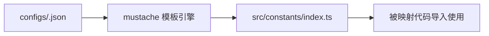

# [根目录](../../CLAUDE.md) > [src](../) > **constants**

## 模块职责

constants 模块定义全局常量，包括网络信息、版本号、核心地址等。这些常量在多个模块间共享，确保配置的一致性。本模块是构建时生成的动态文件（通过 mustache 模板）。

## 入口与启动

### 生成方式
通过 mustache 模板系统从配置生成：
```bash
# 生成文件
npm run generate-constants:optimism
npm run generate-constants:sepolia
```

### 模板文件
- `src/constants/index.ts.template` → `src/constants/index.ts`

### 构建流程


## 对外接口

### 核心常量定义

#### 网络配置
```typescript
export const Network = "sepolia"        // 网络名称
export const ChainId = "11155111"       // 链 ID
export const Version = "2.4.3"          // 合约版本
```

#### 核心地址
```typescript
export const USDCAddress = Address.fromString("0x727e...")        // USDC 合约地址
export const QuoteTokenAddress = Address.fromString("0xE62C...")  // 计价代币地址
```

#### 代币映射
```typescript
// 基础代币符号映射
export const baseTokenSymbolMap = new TypedMap<Address, string>()

// 抵押品信息映射
export const collateralMap = new TypedMap<Address, TypedMap<string, string>>()

// 常用代币实例
export const USDC = new TypedMap<string, string>()
export const WETH = new TypedMap<string, string>()
export const WBTC = new TypedMap<string, string>()
```

## 关键依赖与配置

### 模板依赖
- **模板文件**: `src/constants/index.ts.template`
- **数据源**: `configs/<network>.json`
- **mustache 引擎**: 通过 npm 脚本调用

### 运行时依赖
- `@graphprotocol/graph-ts`: Address, TypedMap 类型

### 使用方式
```typescript
// 映射代码中导入
import { Network, ChainId, Version, USDCAddress } from "../constants"

// 工具代码中导入
import { collateralMap } from "../constants"
```

## 数据模型

### 模板变量
| 变量名 | 类型 | 来源 | 说明 |
|--------|------|------|------|
| `network` | string | configs/*.json | 网络名称 |
| `core.chainId` | number | configs/*.json | 链 ID |
| `core.version` | string | configs/*.json | 版本号 |
| `core.contracts` | object | configs/*.json | 合约地址映射 |
| `core.collaterals` | array | configs/*.json | 抵押品配置 |

### 地址格式
- 所有地址使用 `Address.fromString()` 包装
- 确保与 `@graphprotocol/graph-ts` 类型兼容

### 字符串值
- 代币名称、符号存储为 string
- decimals 转换为 string (避免数字类型在 mustache 中问题)

## 使用场景

### 1. 合约地址引用
```typescript
// 在映射中获取合约地址
const vaultAddress = config.core.contracts.Vault.address

// 比较地址
if (event.address.equals(USDCAddress)) {
    // 处理 USDC 相关逻辑
}
```

### 2. 网络条件判断
```typescript
// 根据网络选择不同逻辑
if (Network === "sepolia") {
    // 测试网特定逻辑
} else if (Network === "optimism") {
    // 主网逻辑
}
```

### 3. 代币信息访问
```typescript
// 获取代币符号
const symbol = collateralMap.get(tokenAddress)?.get("symbol")

// 获取代币精度
const decimals = BigInt.fromString(collateralMap.get(tokenAddress)?.get("decimals") || "18")
```

## 测试与质量

### 当前状态
- **无测试**: 常量生成过程无自动测试
- **建议**: 验证生成的地址格式、类型匹配

### 质量检查点
1. **地址格式**: 确保所有地址为 42 字符 (0x + 40 十六进制)
2. **类型匹配**: Address 类型正确导入
3. **完整性**: 所有必需常量都已定义
4. **一致性**: 不同网络的相同常量语义一致

## 常见问题 (FAQ)

### Q: 如何切换网络？
A:
1. 选择对应的网络脚本：`npm run generate-constants:<network>`
2. 重新生成 manifest
3. 重新执行 codegen
4. 重新部署

### Q: 模板文件在哪里？
A: `src/constants/index.ts.template`（当前目录不存在，需检查是否被忽略）

### Q: 如何添加新的常量？
A:
1. 在模板文件中添加变量占位符
2. 在 `configs/*.json` 中添加对应数据
3. 更新生成脚本（如果需要）
4. 重新生成常量文件

### Q: 为什么使用 TypedMap？
A: AssemblyScript 不支持 ES6 Map，TypedMap 是 Graph Protocol 提供的替代方案，支持键值存储但无迭代器方法。

## 相关文件清单

### 生成前后对比
```
生成前:
src/constants/
└── index.ts.template  # mustache 模板

生成后:
src/constants/
└── index.ts           # 实际使用的常量文件
```

### 配置文件
- `configs/sepolia.json`
- `configs/optimism.json`
- `configs/optimismGoerli.json`

### 使用的脚本
```json
{
  "generate-constants:optimism": "mustache configs/optimism.json src/constants/index.ts.template > src/constants/index.ts",
  "generate-constants:sepolia": "mustache configs/sepolia.json src/constants/index.ts.template > src/constants/index.ts"
}
```

## 变更记录 (Changelog)

### [2.0.0] - 2025-11-12
- 初始化常量模块文档
- 记录生成机制和模板系统
- 添加使用示例和最佳实践
