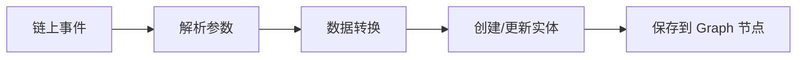

# [根目录](../../CLAUDE.md) > [src](../) > **mappings**

## 模块职责

mappings 模块包含所有事件映射处理器，负责将链上合约事件转换为 GraphQL 实体数据。每个映射文件对应一个或多个合约事件，实现数据提取、转换和存储逻辑。

## 入口与启动

### 映射执行流程
1. 子图节点监听链上事件
2. 根据 `subgraph.yaml` 配置调用对应处理器
3. 处理器执行数据转换逻辑
4. 保存实体到 Graph 节点

### 主要入口函数
```typescript
// 每个文件导出的事件处理器
export function handlePositionChanged(event: PositionChangedEvent)
export function handleDeposited(event: DepositedEvent)
export function handlePoolAdded(event: PoolAddedEvent)
// ... 更多处理器
```

## 对外接口

### 处理的合约事件
| 合约 | 事件数量 | 主要事件 |
|------|---------|----------|
| **ClearingHouse** | 6个 | PositionChanged, PositionClosed, LiquidityChanged |
| **Vault** | 4个 | Deposited, Withdrawn, CollateralLiquidated |
| **MarketRegistry** | 2个 | PoolAdded, FeeRatioChanged |
| **AccountBalance** | 1个 | PnlRealized |
| **Exchange** | 1个 | FundingUpdated |
| **InsuranceFund** | 3个 | Repaid, FeeDistributed |
| **CollateralManager** | 1个 | CollateralAdded |
| **DelegateApproval** | 2个 | DelegationApproved, DelegationRevoked |
| **LimitOrderBook** | 多个 | 订单簿相关事件 |
| **LimitOrderRewardVault** | 多个 | 奖励相关事件 |
| **Referrer** | 多个 | 推荐相关事件 |

### 生成的实体类型
- PositionChanged/Closed/Liquidated
- Deposited/Withdrawn
- Market
- Trader
- PnlRealized
- FundingUpdated
- Repaid/FeeDistributed
- CollateralAdded
- DelegationApproved/Revoked

## 关键依赖与配置

### 外部依赖
- `@graphprotocol/graph-ts`: 事件和实体类型
- `../../generated/schema`: GraphQL 实体定义
- `../constants/index.ts`: 网络常量

### 内部依赖
- `../utils/stores.ts`: 实体创建和管理函数
- `../utils/numbers.ts`: 数值转换工具
- `../utils/token.ts`: 代币信息获取
- `../hard-fixed-data/`: 网络配置数据

## 数据模型

### 核心数据流


### 关键实体字段
- **ID**: 使用 `transactionHash-logIndex` 格式确保唯一性
- **地址**: 使用 `Address` 类型
- **数值**: 使用 `BigDecimal` (金额) 和 `BigInt` (整数)
- **时间**: 使用 `block.timestamp` 和 `block.number`

### 数值处理规范
```typescript
// 金额转换（从 18 位精度）
const amount = fromWei(event.params.amount, token.decimals)

// 区块号和日志索引组合
const id = `${event.transaction.hash.toHexString()}-${event.logIndex.toString()}`

// 创建实体
const entity = new EntityType(id)
```

## 测试与质量

### 当前状态
- **无单元测试**: 建议添加映射函数单元测试
- **无集成测试**: 建议添加完整数据流测试

### 质量建议
1. 验证所有事件处理器都有错误处理
2. 检查数值转换的精度处理
3. 确保实体关联关系正确
4. 定期执行健康检查

## 常见问题 (FAQ)

### Q: 如何处理事件重放？
A: 处理器应设计为幂等的，重复执行不应产生副作用。使用 `getOrCreate` 模式确保数据一致性。

### Q: 大额数值如何处理？
A: 使用 `BigDecimal` 替代浮点数，避免精度损失。数值转换使用 `fromWei()` 函数。

### Q: 如何优化映射性能？
A:
- 避免在循环中进行存储操作
- 批量更新相关实体
- 使用缓存减少重复查询
- 合理使用 `load()` vs `getOrCreate()`

### Q: 合约升级后事件签名变化？
A: 更新 ABI 文件和事件处理器，确保参数类型匹配。测试新的事件格式。

## 相关文件清单

### 映射文件列表
| 文件名 | 处理的合约 | 事件数量 |
|--------|-----------|---------|
| clearingHouse.ts | ClearingHouse | 6 |
| vault.ts | Vault | 4 |
| marketRegistry.ts | MarketRegistry | 2 |
| accountBalance.ts | AccountBalance | 1 |
| exchange.ts | Exchange | 1 |
| insuranceFund.ts | InsuranceFund | 3 |
| collateralManager.ts | CollateralManager | 1 |
| delegateApproval.ts | DelegateApproval | 2 |
| limitOrderBook.ts | LimitOrderBook | N |
| limitOrderRewardVault.ts | LimitOrderRewardVault | N |
| referrer.ts | Referrer | N |

### 关键工具函数（来自 ../utils/stores.ts）
```typescript
getOrCreateProtocol()           // 创建/获取协议实体
getOrCreateMarket(baseToken)    // 创建/获取市场实体
getOrCreateTrader(address)      // 创建/获取交易者实体
getOrCreateToken(address)       // 创建/获取代币实体
getBlockNumberLogIndex(event)   // 生成唯一 ID
```

## 变更记录 (Changelog)

### [2.0.0] - 2025-11-12
- 初始化映射模块文档
- 记录所有事件处理器和实体类型
- 添加性能优化建议
