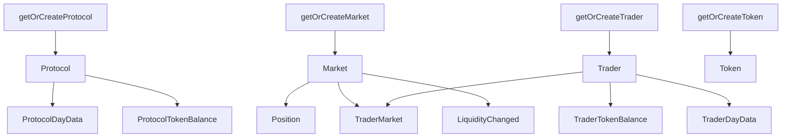

# [根目录](../../CLAUDE.md) > [src](../) > **utils**

## 模块职责

utils 模块提供通用的工具函数和辅助方法，支持数据转换、实体存储、数值计算等核心功能。本模块是映射逻辑的基础依赖，确保数据处理的一致性和可维护性。

## 入口与启动

本模块为库模块，不直接执行。通过被其他模块导入使用：
```typescript
import { fromWei, BD_ZERO, BI_ZERO } from "../utils/numbers"
import { getOrCreateTrader } from "../utils/stores"
import { fetchTokenSymbol } from "../utils/token"
```

## 对外接口

### 核心工具函数

#### 1. stores.ts - 实体存储管理
**功能**: 提供实体的创建、获取和更新方法

**主要函数**:
```typescript
getOrCreateProtocol(): Protocol
getOrCreateProtocolEventInfo(): ProtocolEventInfo
getOrCreateMarket(baseToken: Address): Market
getOrCreateTrader(address: Address): Trader
getOrCreateToken(address: Address): Token
getOrCreateTraderMarket(trader: Address, baseToken: Address): TraderMarket
getOrCreateMaker(address: Address, baseToken: Address): Maker
getOrCreateOpenOrder(maker: Address, baseToken: Address, orderId: BigInt): OpenOrder
getOrCreateProtocolTokenBalance(token: Address): ProtocolTokenBalance
getOrCreateTraderTokenBalance(trader: Address, token: Address): TraderTokenBalance
getTraderDayData(trader: Address, timestamp: BigInt): TraderDayData
getOrCreateProtocolDayData(timestamp: BigInt): ProtocolDayData
getReferralCodeDayData(code: Bytes, timestamp: BigInt): ReferralCodeDayData
getReferralCode(code: Bytes): ReferralCode
getBlockNumberLogIndex(event: ethereum.Event): BigInt
```

#### 2. token.ts - 代币信息管理
**功能**: 从硬编码映射中获取代币元数据

**主要函数**:
```typescript
fetchTokenSymbol(tokenAddress: Address): string
fetchTokenName(tokenAddress: Address): string
fetchTokenDecimals(tokenAddress: Address): BigInt
```

#### 3. numbers.ts - 数值转换和计算
**功能**: 提供数值精度转换和数学计算工具

**主要函数**:
```typescript
// 数值常量
const BI_ZERO = BigInt.fromI32(0)
const BD_ZERO = BigDecimal.fromString("0")
const RATIO_ONE = BigDecimal.fromString("1")

// 转换函数
fromWei(value: BigInt, decimals: BigInt): BigDecimal
toWei(value: BigDecimal, decimals: BigInt): BigInt
fromSqrtPriceX96(value: BigInt): BigDecimal

// 数学计算
abs(value: BigDecimal): BigDecimal
```

## 关键依赖与配置

### 外部依赖
- `@graphprotocol/graph-ts`: Address, BigInt, BigDecimal, ethereum.Event
- `../../generated/schema`: 所有实体类型定义
- `../constants/index.ts`: Network, ChainId, Version 等常量

### 内部依赖
- stores.ts ← token.ts, numbers.ts, constants/index.ts
- token.ts ← constants/index.ts
- numbers.ts ← 无外部依赖

## 数据模型

### 实体关系图


### ID 生成规则
- **Protocol**: `"perpetual-protocol"` (硬编码)
- **ProtocolEventInfo**: `"protocol-event-info"` (硬编码)
- **Market**: `baseToken.toHexString()`
- **Trader**: `trader.toHexString()`
- **Token**: `tokenAddress.toHexString()`
- **TraderMarket**: `trader.toHexString() + "-" + baseToken.toHexString()`
- **事件实体**: `transactionHash.toHexString() + "-" + logIndex.toString()`

### 数值精度处理
```typescript
// 地址常量
const ADDRESS_ZERO = "0x0000000000000000000000000000000000000000"

// 区块号-日志索引组合 (避免碰撞)
// 10M = 最大日志索引理论值
getBlockNumberLogIndex(event) {
    return event.block.number * 10_000_000 + event.logIndex
}
```

## 测试与质量

### 当前状态
- **无单元测试**: 工具函数缺乏测试覆盖
- **风险**: 数值转换错误可能导致数据不一致

### 建议测试用例
1. **stores.ts**
   - 测试实体创建和更新逻辑
   - 验证 ID 生成规则
   - 测试重复创建的处理

2. **token.ts**
   - 测试已知代币信息获取
   - 测试未知代币的降级处理

3. **numbers.ts**
   - 测试不同精度转换
   - 测试大数值的处理
   - 测试边界条件 (0, 极值)

## 常见问题 (FAQ)

### Q: 何时使用 `load()` vs `getOrCreate()`？
A:
- `load()`: 仅获取已存在的实体，不创建新实体
- `getOrCreate()`: 获取实体，不存在则创建新实体
- 根据业务逻辑选择：事件更新用 `getOrCreate()`，查询用 `load()`

### Q: 如何处理数值精度损失？
A:
- 使用 `BigDecimal` 而非 JavaScript 原生 Number
- 金额转换统一使用 `fromWei()` 函数
- 不同代币使用其对应的 decimals

### Q: 实体关联关系如何维护？
A:
- 外键字段使用 `!` 标记（必需）
- 关系通过 `@derivedFrom` 或直接引用维护
- 创建子实体前确保父实体已存在

### Q: 如何优化存储操作？
A:
- 避免在循环中调用 `entity.save()`
- 批量更新相关实体
- 合理使用中间变量缓存数据

## 相关文件清单

### 文件列表
```
src/utils/
├── stores.ts       # 实体存储管理 (约400行)
├── token.ts        # 代币信息获取 (约30行)
├── numbers.ts      # 数值转换工具 (约100行)
└── CLAUDE.md       # 本文档
```

### 使用示例
```typescript
// 在映射函数中使用
import { getOrCreateTrader, getBlockNumberLogIndex } from "../utils/stores"
import { fromWei } from "../utils/numbers"
import { fetchTokenDecimals } from "../utils/token"

export function handleDeposited(event: DepositedEvent): void {
    // 创建交易者
    const trader = getOrCreateTrader(event.params.trader)

    // 获取代币精度
    const token = getOrCreateToken(event.params.collateralToken)
    const amount = fromWei(event.params.amount, token.decimals)

    // 创建事件实体
    const deposited = new Deposited(getBlockNumberLogIndex(event))
    deposited.amount = amount
    deposited.save()
}
```

## 变更记录 (Changelog)

### [2.0.0] - 2025-11-12
- 初始化工具模块文档
- 记录所有工具函数和使用方法
- 添加实体关系图和 ID 规则
